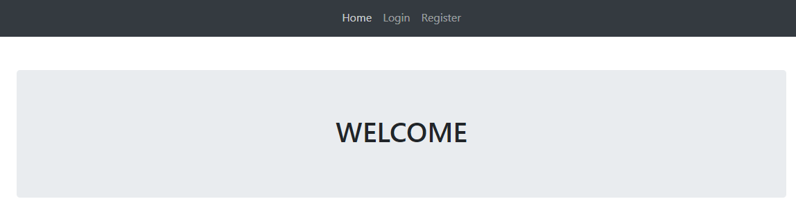
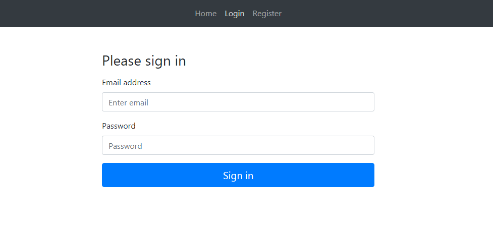
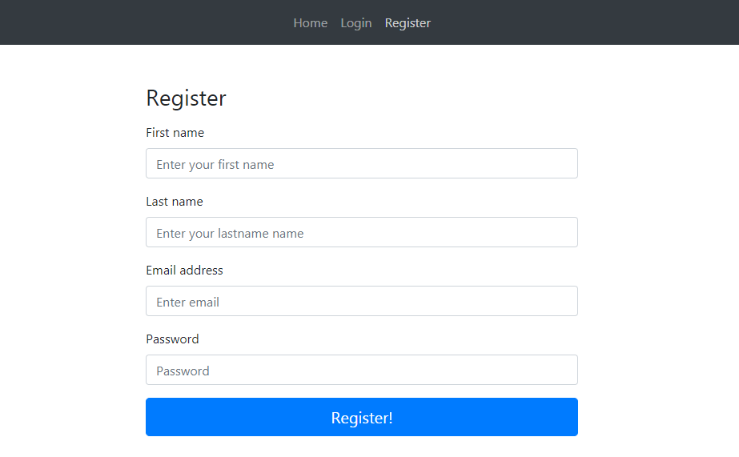
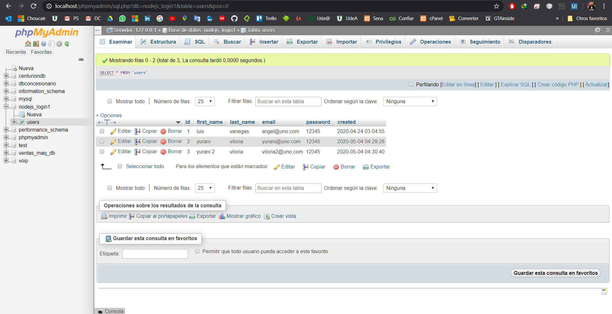

# login_reg_mysql
Application MEAN with Mysql for login and register of user

# Version

* Angular CLI: 9.0.7
* Node: 12.16.1
* OS: win32 x64

# MEAN Login and Register with Token and MySQL

#

#

#

# Initial Configuration
1. Create the data base with name: `nodejs_login1`
2. Execute the script data base for create the DB structure in phpmyadmin.
3. Clone the repo and execute `npm install` in the Node js server and into Angular client.

## Execution of Data Base MySQL
1. Execute a SGBD (XAMPP) 

## Execution of NodeJS Server
1. Go to the server path in the CMD
2. Enter the command `npm run dev`

## Execution of Angular Client
1. Go to the server path in the CMD
2. Enter the command `npm run dev`

# Error Solutions
For Error with: `rxjs` Go to the package.json and change: `"^6.1.0"` for this: `"6.1.0"`
